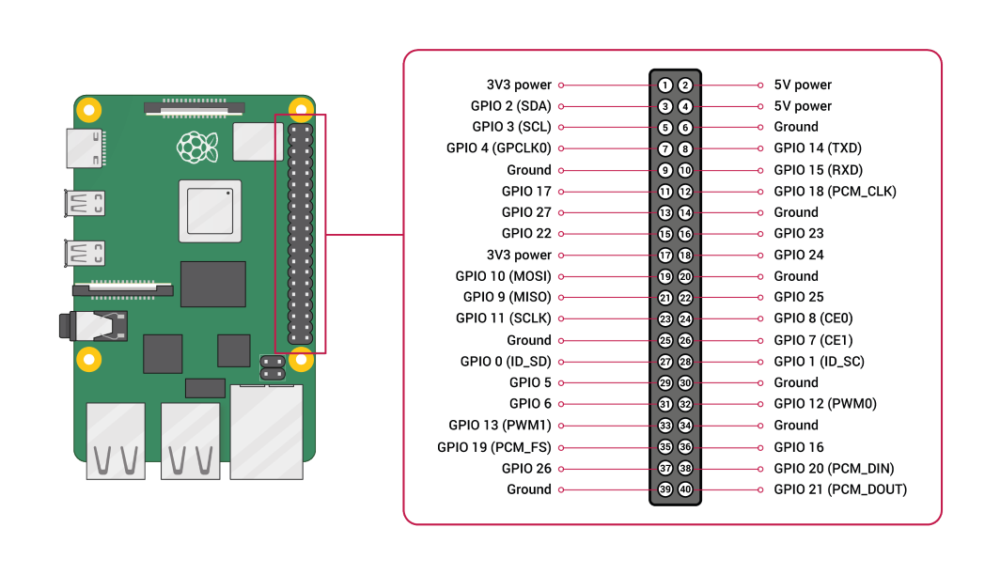

# 
Welcome to _Light Play_ !

### Table of Contents
1. [About the Project](#about-the-project)
    + [Built With](#build-with)
2. [Getting Started](#getting-started)
    + [Prerequisites](#prerequisites)
    + [Installation](#installation)
3. [Usage](#usage)
4. [License](#license)

## 
About the Project

_Light Play_ is a little project which was created to play some simple light animations with a Raspberry Pi and some LEDs.

### Build With
[PyCharm](https://www.jetbrains.com/pycharm/)

## 
Getting Started

### Prerequisites
First make sure that you've connected six LEDs to the GPIO Pins of your Raspberry Pi.
They must be connected in the following order **GPIO22, GPIO27, GPIO 17, GPIO 25, GPIO 24 and GPIO 23.**
The picture underneath shows where to find the correct pins.

If you don't know how to connect a LED to a Raspberry Pi click [here](https://projects.raspberrypi.org/en/projects/rpi-connect-led).

The Picture was taken from the official [Raspberry Pi Website](https://www.raspberrypi.org/documentation/usage/gpio/).

After you've connected the LEDs, you should make sure that your Raspberry Pi is up to date. 
To do so tap the following command into your terminal and press enter after you're done.

    sudo apt update

Now go ahead with the next one and press enter.

    sudo apt full-upgrade

Your little Pi should be up to date now. To use _Light Play_ you also have to install the RPi.GPIO module. It's used to control 
the GPIO pins of your Raspberry Pi easily. For more information about this package please click [here](https://pypi.org/project/RPi.GPIO/).

To install RPi.GPIO tap the following command into the terminal and press enter.

    pip install RPi.GPIO

You're ready to install _Light Play_ now!

### Installation
To install _Light Play_ just tap the following command into your terminal and press enter.

    git clone https://github.com/GreyZenTiger/light-play.git

## 
Usage

Open _Light Play_ by tapping the next line into your terminal.

    cd light-play

To run _Light Play_ you just need to tap that last command into your terminal.

    python3 light_play.py 1

You could switch the light effect by changing the number at the end of the command. Use 1 for the 
_Knight Rider Light_, 2 for _Flickering Light_ or 3 for _Clapping Light_.

## 
License

This software is published under the [GPLv3 license](https://www.gnu.org/licenses/gpl-3.0.en.html).
